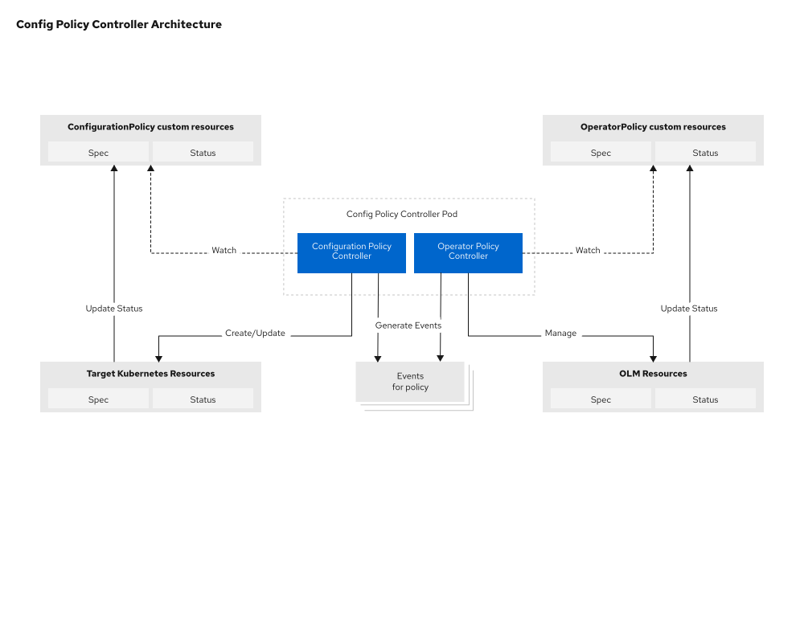

[comment]: # ( Copyright Contributors to the Open Cluster Management project )

# Configuration Policy Controller

Open Cluster Management - Configuration Policy Controller

[](https://github.com/open-cluster-management-io/config-policy-controller/actions/workflows/kind.yml)
[](http://www.apache.org/licenses/LICENSE-2.0.html)

## Policy Controllers Overview

### Configuration Policy Controller

With the Configuration Policy Controller, you can create `ConfigurationPolicies` to check if the specified objects are present in the cluster. The controller records compliancy details in the `status` of each ConfigurationPolicy, and as Kubernetes Events. If the policy is set to `enforce` the configuration, then the controller will attempt to create, update, or delete objects on the cluster as necessary to match the specified state. The controller can be run as a stand-alone program or as an integrated part of governing risk with the Open Cluster Management project.

The `ConfigurationPolicy` spec includes the following fields:

| Field | Description |
| ---- | ---- |
| severity | Optional: `low`, `medium`, `high`, or `critical`. |
| remediationAction | Required:  `inform` or `enforce`. Determines what actions the controller will take if the actual state of the object-templates does not match what is desired. |
| namespaceSelector | Optional: an object with `include` and `exclude` lists, specifying where the controller will look for the actual state of the object-templates, if the object is namespaced and not already specified in the object. |
| object-templates | Recommended: A list of Kubernetes objects that will be checked on the cluster. Keys inside of the objectDefinition may point to values that have Go templates. Only one of `object-templates` and `object-templates-raw` may be set in a configuration policy. |
| object-templates-raw | For advanced use cases: A raw template string for Go templating such as `range` loops and `if` conditionals. Only one of `object-templates` and `object-templates-raw` may be set in a configuration policy. |

Additionally, each item in the `object-templates` includes these fields:

| Field | Description |
| ---- | ---- |
| complianceType | Required: `musthave`, `mustnothave` or `mustonlyhave`. Determines how to decide if the cluster is compliant with the policy. |
| objectDefinition | Required: A Kubernetes object which must (or must not) match an object on the cluster in order to comply with this policy. |

Following is an example spec of a `ConfigurationPolicy` object:
```yaml
apiVersion: policy.open-cluster-management.io/v1
kind: ConfigurationPolicy
metadata:
  name: policy-pod-example
spec:
  remediationAction: enforce
  severity: low
  namespaceSelector:
    exclude: ["kube-*"]
    include: ["default"]
  object-templates:
    - complianceType: musthave
      objectDefinition:
        apiVersion: v1
        kind: Pod
        metadata:
          name: sample-nginx-pod
        spec:
          containers:
          - image: nginx:1.18.0
            name: nginx
            ports:
            - containerPort: 80
```

#### Templating

Configuration Policies supports inclusion of [Golang text templates](https://golang.org/pkg/text/template/) in  ObjectDefinitions. These templates are resolved at runtime on the target cluster using configuration local to that cluster giving the user the ability to define policies customized to the target cluster. Following custom template functions are available to allow referencing kube-resources on the target cluster.

1. `fromSecret` - returns the value of the specified data key in the  Secret resource
2. `fromConfigMap` - returns the values of the specified data key in the ConfigMap resource.
3. `fromClusterClaim` - returns the value of Spec.Value field in the ClusterClaim resource.
4. `lookup` - a generic lookup function to retreive any kube resource.

Following is an example spec of a `ConfigurationPolicy` object with templates:

```yaml

apiVersion: policy.open-cluster-management.io/v1
kind: ConfigurationPolicy
metadata:
  name: demo-templates
  namespace: test-templates
spec:
  namespaceSelector:
    exclude:
    - kube-*
    include:
    - default
  object-templates:
  - complianceType: musthave
    objectDefinition:
      kind: ConfigMap
      apiVersion: v1
      metadata:
        name: demo-templates
        namespace: test
      data:
        # Configuration values can be set as key-value properties
        app-name: sampleApp
        app-description: "this is a sample app"
        app-key: '{{ fromSecret "test" "testappkeys" "app-key"  | base64dec }}'
        log-file: '{{ fromConfigMap "test" "logs-config" "log-file" }}'
        appmetrics-url: |
          http://{{ (lookup "v1" "Service" "test" "appmetrics").spec.clusterIP }}:8080
        app-version: version: '{{ fromClusterClaim "version.openshift.io" }}'
  remediationAction: enforce
  severity: low

```

### Operator Policy Controller

With the Operator Policy Controller, you can create `OperatorPolicy` resources to manage operators deployed by the Operator Lifecycle Manager (OLM). The controller automates operator lifecycle management, including installation, upgrades, and removal. It monitors operator health by tracking subscription status, cluster service versions, and deployments, then records compliance details in the `status` of each OperatorPolicy and as Kubernetes Events. If the policy is set to `enforce`, the controller automatically approves install and upgrade plans according to your configuration.

The `OperatorPolicy` spec includes the following fields:

| Field | Description |
| ---- | ---- |
| severity | Optional: `low`, `medium`, `high`, or `critical`. Defines the severity level when the policy is noncompliant. |
| remediationAction | Required: `inform` or `enforce`. Determines what actions the controller will take if the operator is not in the desired state. |
| complianceType | Required: `musthave` or `mustnothave`. Determines if the operator must be installed or must not be installed. |
| subscription | Required: An Operator Lifecycle Manager (OLM) `Subscription` resource specification for the operator. `subscription.spec.name` is required. Any other spec fields will use default values if not specified. Do NOT include `subscription.spec.installPlanApproval` - see `upgradeApproval` below.|
| operatorGroup | Optional: An OLM `OperatorGroup` resource specification. If not specified and no OperatorGroup exists in the namespace, the controller creates an `AllNamespaces` type OperatorGroup by default. |
| versions | Optional: A list of templatable ClusterServiceVersion names that specifies which installed ClusterServiceVersion names are compliant when in `inform` mode and which `InstallPlans` are approved when in `enforce` mode. Multiple versions can be provided in one entry by separating them with commas. An empty list approves all versions. |
| upgradeApproval | Required: `None` or `Automatic`. Specifies whether to automatically approve operator upgrade install plans when the policy is enforced and in `musthave` mode. The initial InstallPlan approval is not affected by this setting. |
| removalBehavior | Optional: Defines resource cleanup behavior when the policy is set to `mustnothave`. |
| complianceConfig | Optional: Defines how resource conditions affect overall policy compliance. |

#### Removal behavior

The `removalBehavior` field controls which resources the controller removes when the policy is set to `mustnothave` and `enforce` mode. All sub-fields are optional and have default values applied when not specified.

| Sub-field | Description | Default |
| ---- | ---- | ---- |
| subscriptions | Whether to delete the `Subscription` resource. Valid values: `Keep`, `Delete`. | `Delete` |
| operatorGroups | Whether to delete the `OperatorGroup` resource. Valid values: `Keep`, `DeleteIfUnused`. Only deletes the OperatorGroup if no other resources use it. | `DeleteIfUnused` |
| clusterServiceVersions | Whether to delete the `ClusterServiceVersion` resource. Valid values: `Keep`, `Delete`. | `Delete` |
| customResourceDefinitions | Whether to delete `CustomResourceDefinitions` associated with the operator. Valid values: `Keep`, `Delete`. Defaults to `Keep` because deleting CRDs should be done deliberately. | `Keep` |

#### Compliance configuration

The `complianceConfig` field defines how different resource conditions affect the overall operator policy compliance state. All sub-fields are optional and have default values applied when not specified.

| Sub-field | Description | Default |
| ---- | ---- | ---- |
| catalogSourceUnhealthy | How to report the policy when the `CatalogSource` is unhealthy. Valid values: `Compliant`, `NonCompliant`. | `Compliant` |
| deploymentsUnavailable | How to report the policy when operator deployments are unavailable. Valid values: `Compliant`, `NonCompliant`. | `NonCompliant` |
| upgradesAvailable | How to report the policy when operator upgrades are available through `InstallPlan`. Valid values: `Compliant`, `NonCompliant`. | `Compliant` |
| deprecationsPresent | How to report the policy when deprecated features are detected in the operator. Valid values: `Compliant`, `NonCompliant`. | `Compliant` |
| minorChannelUpgradeAvailable | How to report the policy when a newer minor version channel is available when `upgradeApproval` is `Automatic`. Valid values: `Compliant`, `NonCompliant`. | `Compliant` |

Following is an example spec of an `OperatorPolicy` object to install the external secrets operator at version 0.11.0. The ESO operator was chosen randomly out of the operators available in the OperatorHub catalog.

Notice the `upgradeApproval` is set to `None` and the `versions` list only contains `external-secrets-operator.v0.11.0`. This means the policy will install version 0.11.0 and will not automatically approve any upgrades for the operator.

```yaml
apiVersion: policy.open-cluster-management.io/v1beta1
kind: OperatorPolicy
metadata:
  name: policy-eso
spec:
  remediationAction: enforce
  severity: medium
  complianceType: musthave
  upgradeApproval: None
  operatorGroup:
    namespace: default
    name: external-secrets-operator-group
    targetNamespaces:
      - default
  subscription:
    namespace: default
    name: external-secrets-operator
    channel: alpha
    source: operatorhubio-catalog
    sourceNamespace: olm
    startingCSV: external-secrets-operator.v0.11.0
  versions:
    - external-secrets-operator.v0.11.0
```

#### Templating

The Operator Policy Controller also supports Golang text templates in the specification. This allows you to customize operator subscriptions based on cluster-specific configuration at runtime.

Following is an example spec of an `OperatorPolicy` object with templates. With `remediationAction` set to `inform`, the policy will detect whether an external secrets operator deployed in the namespace `my-namespace` matches the policy spec. It will read the `operatorGroup.targetNamespaces` and the `subscription.channel` from a ConfigMap `my-operator-configs` located in the namespace `my-namespace`.

```yaml
apiVersion: policy.open-cluster-management.io/v1beta1
kind: OperatorPolicy
metadata:
  name: eso-operator-with-templates
spec:
  remediationAction: inform
  severity: medium
  complianceType: musthave
  upgradeApproval: None
  operatorGroup:
    name: my-operator-group
    namespace: my-namespace
    targetNamespaces: '{{ (fromConfigMap "my-namespace" "my-operator-configs" "namespaces") | toLiteral }}'
  subscription:
    channel: '{{ (lookup "v1" "ConfigMap" "my-namespace" "my-operator-configs").data.channel }}'
    name: external-secrets-operator
    namespace: my-namespace
    source: operatorhubio-catalog
    sourceNamespace: olm
    startingCSV: external-secrets-operator.v0.11.0
  versions:
    - external-secrets-operator.v0.11.0
```

For more information about templating, see the Configuration Policy Controller [Templating](#templating) section above.

### Architecture

The Deployment `config-policy-controller` contains two main controllers: Configuration Policy Controller and Operator Policy Controller. Both evaluate policy rules and support Golang text templates.

**Configuration Policy Controller** - Watches for `ConfigurationPolicy` resources and evaluates Kubernetes objects against desired state specifications.

**Operator Policy Controller** - Manages the lifecycle of Operator Lifecycle Manager (OLM) operators through `OperatorPolicy` resources. Handles `Subscriptions`, `OperatorGroups`, and monitors the health of operator deployments and `ClusterServiceVersions`. The controller can manage operator installation, upgrades, and removal with configurable behaviors for resource cleanup.



## Getting started

Go to the
[Contributing guide](https://github.com/open-cluster-management-io/community/blob/main/sig-policy/contribution-guidelines.md)
to learn how to get involved.

### Steps for development

  - Build code
    ```bash
    make build
    ```
  - Run controller locally against the Kubernetes cluster currently configured with `kubectl`
    ```bash
    export WATCH_NAMESPACE=<namespace>
    make run
    ```
    (`WATCH_NAMESPACE` can be any namespace on the cluster that you want the controller to monitor for policies.)


### Steps for deployment

  - (optional) Build container image
    ```bash
    make build-images
    ```
    - The image registry, name, and tag used in the image build, are configurable with:
      ```bash
      export REGISTRY=''  # (defaults to 'quay.io/open-cluster-management')
      export IMG=''       # (defaults to the repository name)
      export TAG=''       # (defaults to 'latest')
      ```
  - Deploy controller to a cluster

    The controller is deployed to a namespace defined in `KIND_NAMESPACE` and monitors the namepace defined in `WATCH_NAMESPACE` for `ConfigurationPolicy` resources.

    1. Deploy the controller and related resources
       ```bash
       make deploy
       ```

       The deployment namespaces are configurable with:
       ```bash
       export KIND_NAMESPACE=''  # (defaults to 'open-cluster-management-agent-addon')
       export WATCH_NAMESPACE=''       # (defaults to 'managed')
       ```
    **NOTE:** Please be aware of the community's [deployment images](https://github.com/open-cluster-management-io/community#deployment-images) special note.


### Steps for test

  - Code linting
    ```bash
    make fmt
    ```
  - Unit tests
    - Install prerequisites
      ```bash
      make test-dependencies
      ```
    - Run unit tests
      ```bash
      make test
      ```
  - E2E tests
    1. Prerequisites:
       - [docker](https://docs.docker.com/get-docker/)
       - [kind](https://kind.sigs.k8s.io/docs/user/quick-start/)
    2. Start KinD cluster (make sure Docker is running first)
       ```bash
       make kind-bootstrap-cluster-dev
       ```
    3. Start the controller locally
       ```bash
       make build
       ```
       ```bash
       export WATCH_NAMESPACE=<namespace>
       make run
       ```
    4. Run E2E tests:
       ```bash
       make e2e-test
       ```

## References

- The `config-policy-controller` is part of the `open-cluster-management` community. For more information, visit: [open-cluster-management.io](https://open-cluster-management.io).
- Check the [Security guide](SECURITY.md) if you need to report a security issue.

<!---
Date: 11/24/2021
-->
